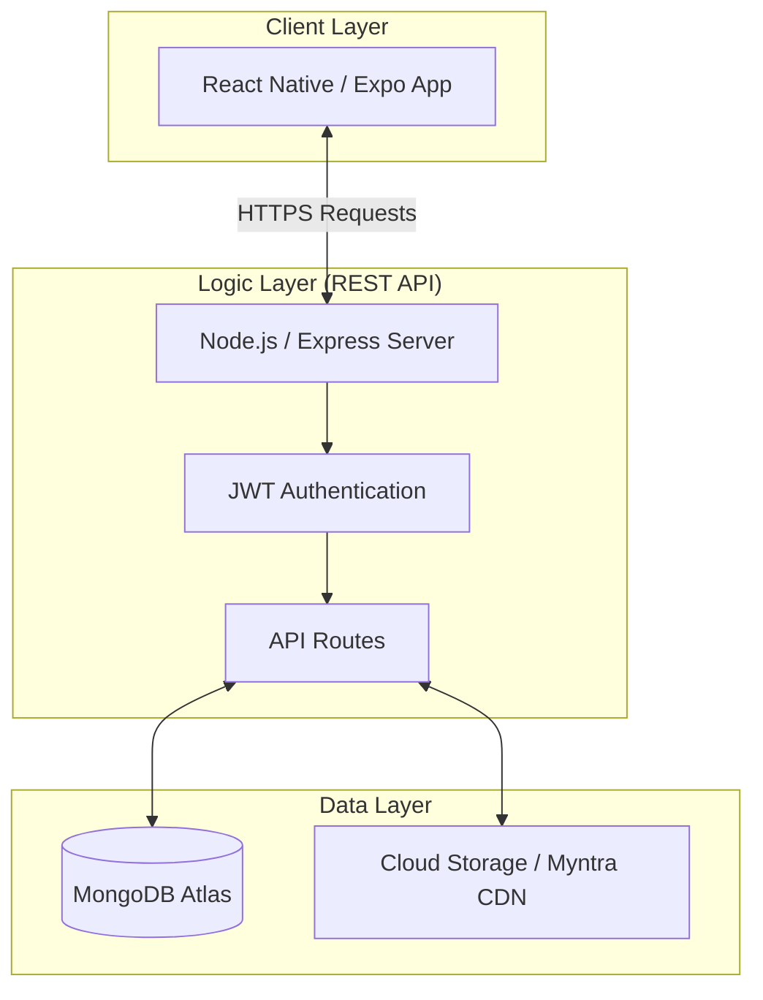
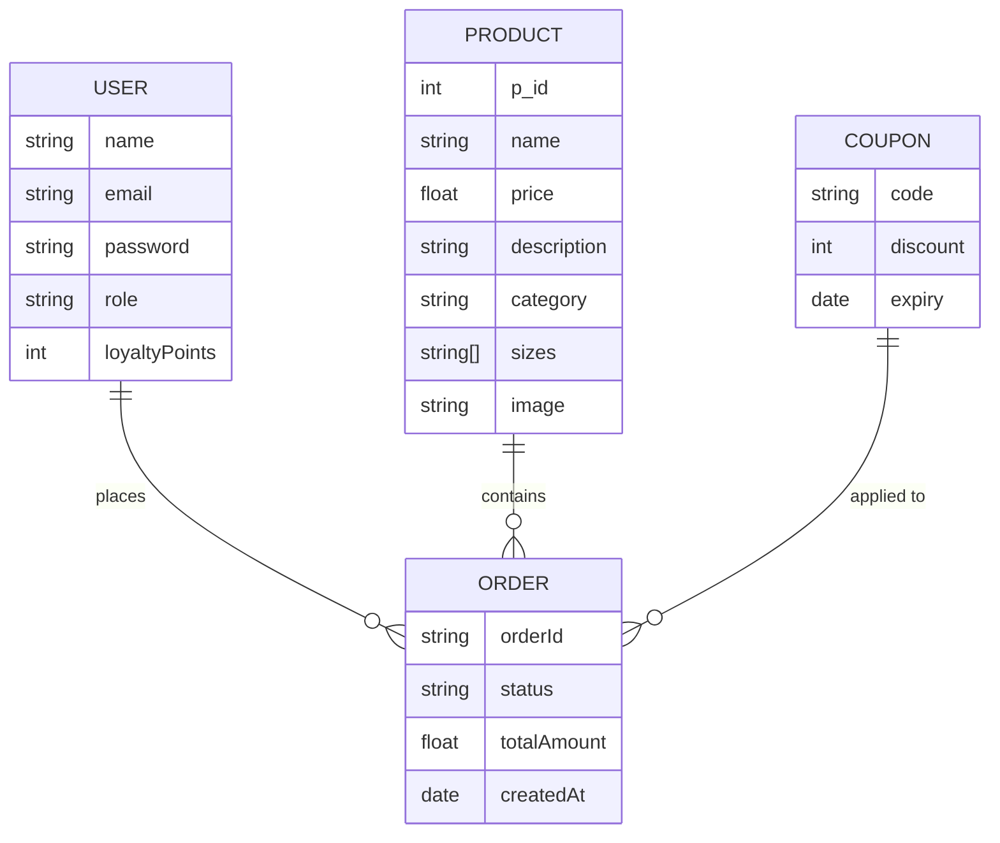

# SE2020 Assignment Submission Documents

This document contains all the necessary sections for your assignment submission. You can copy these into separate files or use the text directly.

## 01. System Architecture Diagram
This diagram shows the high-level architecture of the Calidi Boutique application.



---

## 02. Database Schema Diagram
This diagram shows the core data models and their relationships.



---

## 03. API Endpoint Table

| Module | Method | Endpoint | Description |
| :--- | :--- | :--- | :--- |
| **Auth** | POST | `/api/auth/register` | User registration |
| **Auth** | POST | `/api/auth/login` | User login (returns JWT) |
| **Products** | GET | `/api/products` | Get all products |
| **Products** | GET | `/api/products/:id` | Get single product details |
| **Orders** | POST | `/api/orders` | Place a new order |
| **Orders** | GET | `/api/orders/user` | Get user's order history |
| **Cart** | POST | `/api/cart/add` | Add item to cart |
| **Profile** | GET | `/api/user/profile` | Get current user details |

---

## 04. Team Responsibility (4 Members)

| Member | Role | Responsibilities |
| :--- | :--- | :--- |
| **Member 1** | Team Leader & Backend | API Development, Database Design, Server Deployment |
| **Member 2** | Frontend Developer | React Native UI, State Management, Navigation |
| **Member 3** | UI/UX Designer | Prototype Design, Branding, Component Styling |
| **Member 4** | QA & Documentation | Testing, Bug Reporting, Final Documentation |

---

## 05. README.txt

```text
SE2020 Assignment Submission
-----------------------------

01). GitHub Repository Link
GitHub Repository: https://github.com/samali12345/calidi-app

02). Team Details
Group Number: [INSERT GROUP NUMBER]
Member 1: [IT NUMBER] - [NAME] - Backend Module
Member 2: [IT NUMBER] - [NAME] - Frontend Module
Member 3: [IT NUMBER] - [NAME] - UI/UX Module
Member 4: [IT NUMBER] - [NAME] - QA Module

03). Deployment Details
Backend URL: https://calidi-app-production.up.railway.app
App Type: Expo React Native (Android)
```

---

### Instructions for ZIP Folder:
1. Create a folder named `SE2020_Group_XX_Submission`.
2. Save the **System Architecture Diagram** as `System_Architecture_Diagram.png`.
3. Save the **Database Schema Diagram** as `Database_Schema_Diagram.png`.
4. Copy the **API Table** into a Word/PDF file named `API_Endpoint_Table.pdf`.
5. Copy the **Team Responsibility** table into `Team_Responsibility.pdf`.
6. Save the **README.txt** exactly as shown above.
7. ZIP the folder and upload! **(Do NOT include the code folder)**
